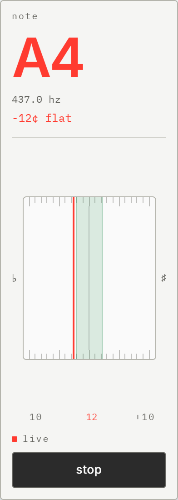

<div align="center">
<br>


### Perfect Pitch

A violin tuner that tells you _how close_ you are,<br>
and a notebook that remembers what you played.

<br>

[**Open**](https://pitch-perfect-ashen.vercel.app/) · Installable · Works offline

<br>


<br>
</div>

## Why

A violin has no frets. Thirty cents flat is still recognisably C4, so a tuner
that only names the note will call a bad note correct.

The cents are the part worth having.

<br>

<div align="center">

</div>

<br>

## Practice

The bed stops being a readout and becomes a record. Green where you were in
tune, red where you were not — a passage leaves a map of its own intonation.


<br>

## Notes

Write a piece in sargam or Western letters. Hear it back. Then practise
against it — a note at a time, or a timed run that scores the whole thing.


<br>

## Phone

Nine octaves do not fit in a portrait column, so the page turns itself on its
side. Install it and it opens with no network at all.

<div align="center">

</div>

<br>

## Run it

```bash
bun install
bun run dev
```

Press **listen** and allow the microphone.

Notes need Firebase — copy `.env.example` to `.env.local`. Without it the
tuner still runs; only signing in is unavailable.

<br>

|                 |                         |
| --------------- | ----------------------- |
| `bun run dev`   | dev server              |
| `bun run build` | typecheck, then build   |
| `bun run test`  | unit tests              |
| `bun run e2e`   | Playwright, real Chrome |
| `bun run lint`  | ESLint                  |

End-to-end tests for notes need `firebase emulators:start`.

<br>

## How

**Pitch** — one equal-temperament formula, anchored at A4 = 440 Hz.

```
frequency(midi) = 440 * 2 ** ((midi - 69) / 12)
```

**Detection** — the McLeod Pitch Method: the first strong peak of a Normalised
Square Difference Function, not the tallest. That is what stops a bowed
string's harmonics reading an octave high. Echo cancellation, noise
suppression and gain control are all off; each one mangles a sustained tone.

One note at a time. Double stops waver between the two.

**Offline** — precache the build, hashed assets cache-first, navigations
network-first with the cached shell behind them. A Vite plugin stamps the file
list in at build, so it cannot drift.

<br>

## Built with

Vite · React 19 · TypeScript · Tailwind 4 · Firebase · Vitest · Playwright

No audio, charting or PWA library. Detection, synthesis, metronome scheduling
and the service worker are all first-party.

<br>

```
src/
├─ lib/          pitch, notation, practice, scoring
├─ hooks/        microphone, preferences, Firestore, install
├─ components/   key bed, readout, meter, editor
├─ routes/       tuner · notes
└─ sw.js         offline
```

<br>

<div align="center">

[Design specs](docs/superpowers/specs/)

</div>
