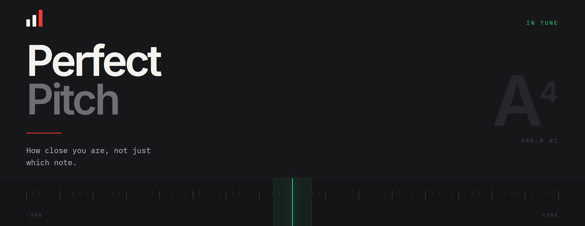
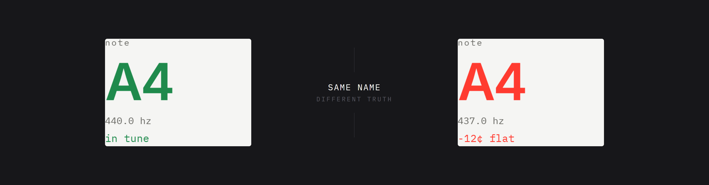
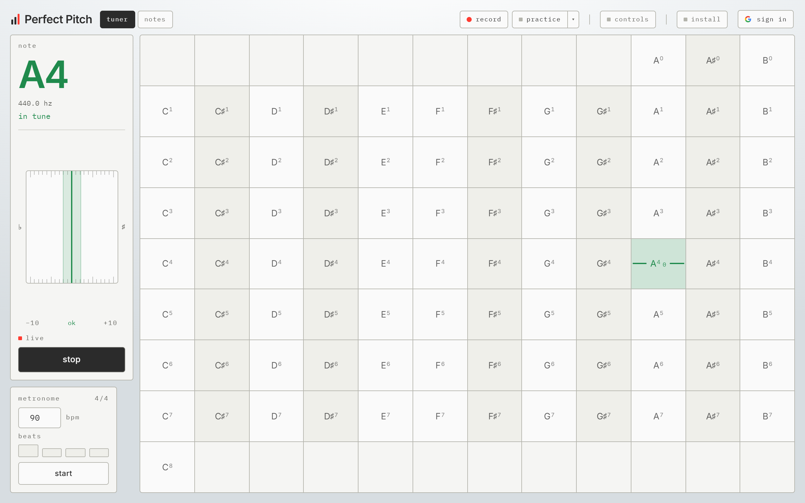
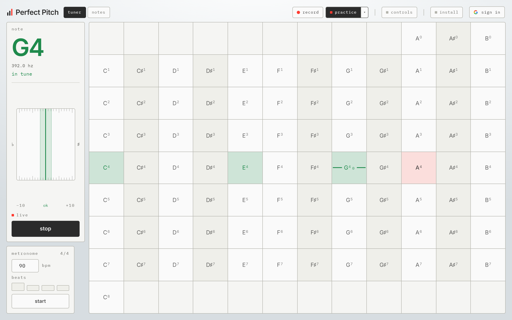
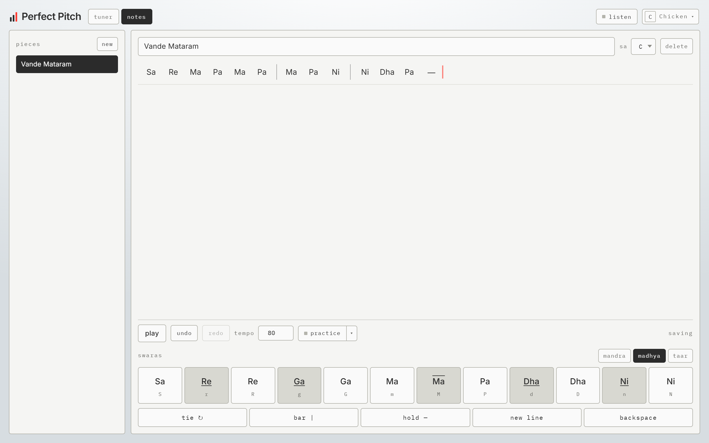
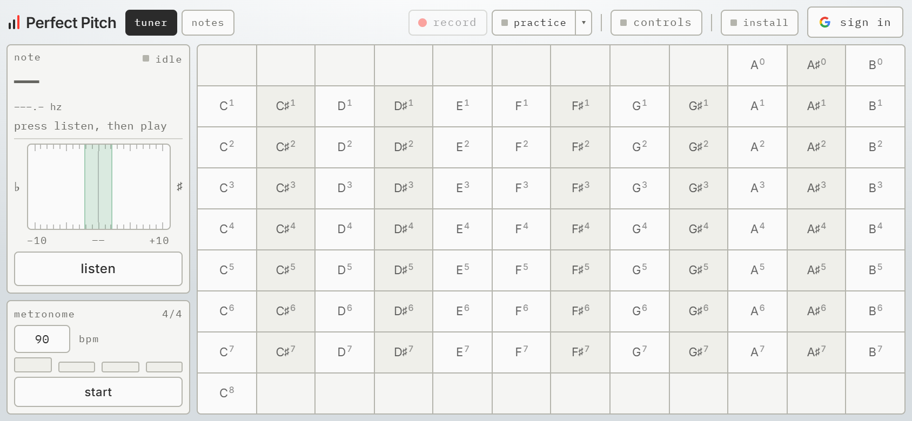

<div align="center">
<br>

[**Open the app**](https://pitch-perfect-ashen.vercel.app/) &nbsp;·&nbsp; Installable &nbsp;·&nbsp; Works offline

<br>
</div>

---

<div align="center">
<br>

<sub>**01** &nbsp; THE PROBLEM</sub>

### A violin has no frets.

Thirty cents flat is still recognisably C4.<br>
A tuner that only names the note will call a bad note correct.

</div>



<div align="center">
<sub><i>The name was never the hard part.</i></sub>
<br><br>
</div>

---

<div align="center">
<br>

<sub>**02** &nbsp; TUNE</sub>

### Every octave, all the time.

</div>



<div align="center">
<sub><i>Eighty-eight keys, because scordatura moves the range. Metronome, drone,<br>and a reference tone under every key.</i></sub>
<br><br>
</div>

---

<div align="center">
<br>

<sub>**03** &nbsp; PRACTICE</sub>

### The bed remembers.

</div>



<div align="center">
<sub><i>Green where you were in tune, red where you were not.<br>A passage leaves a map of its own intonation.</i></sub>
<br><br>
</div>

---

<div align="center">
<br>

<sub>**04** &nbsp; NOTES</sub>

### Write it. Hear it. Play it back.

</div>



<div align="center">
<sub><i>Sargam or Western letters, movable Sa. Then practise against it —<br>a note at a time, or a timed run that scores the whole thing.</i></sub>
<br><br>
</div>

---

<div align="center">
<br>

<sub>**05** &nbsp; ANYWHERE</sub>

### Turns sideways. Installs.

<br>



<sub><i>Nine octaves will not fit a portrait column, so the page turns itself.<br>Installed, it opens with no network at all.</i></sub>

<br>
</div>

---

<br>

## Run it

```bash
bun install
bun run dev
```

Press **listen** and allow the microphone. Notes need Firebase — copy
`.env.example` to `.env.local`. Without it the tuner still runs; only signing
in is unavailable.

<br>

|                 |                         |
| --------------- | ----------------------- |
| `bun run dev`   | dev server              |
| `bun run build` | typecheck, then build   |
| `bun run test`  | unit tests              |
| `bun run e2e`   | Playwright, real Chrome |
| `bun run lint`  | ESLint                  |

<sub>End-to-end tests for notes need `firebase emulators:start`.</sub>

<br>

## How

**Pitch** — one equal-temperament formula, anchored at A4 = 440 Hz.

```
frequency(midi) = 440 * 2 ** ((midi - 69) / 12)
```

**Detection** — the McLeod Pitch Method: the first strong peak of a Normalised
Square Difference Function, not the tallest. That is what stops a bowed
string's harmonics reading an octave high. Echo cancellation, noise
suppression and gain control are all off; each one mangles a sustained tone.

<sub>One note at a time. Double stops waver between the two.</sub>

**Offline** — precache the build, hashed assets cache-first, navigations
network-first with the cached shell behind them. A Vite plugin stamps the file
list in at build, so it cannot drift.

<br>

## Built with

<sub>VITE · REACT 19 · TYPESCRIPT · TAILWIND 4 · FIREBASE · VITEST · PLAYWRIGHT</sub>

No audio, charting or PWA library. Detection, synthesis, metronome scheduling
and the service worker are all first-party.

```
src/
├─ lib/          pitch, notation, practice, scoring
├─ hooks/        microphone, preferences, Firestore, install
├─ components/   key bed, readout, meter, editor
├─ routes/       tuner · notes
└─ sw.js         offline
```

<br>

<div align="center">
<sub>

[Design specs](docs/superpowers/specs/)

</sub>
</div>
