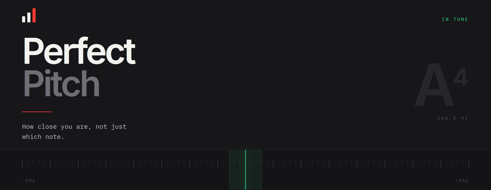
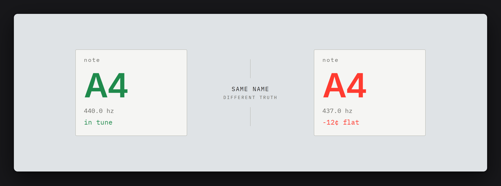
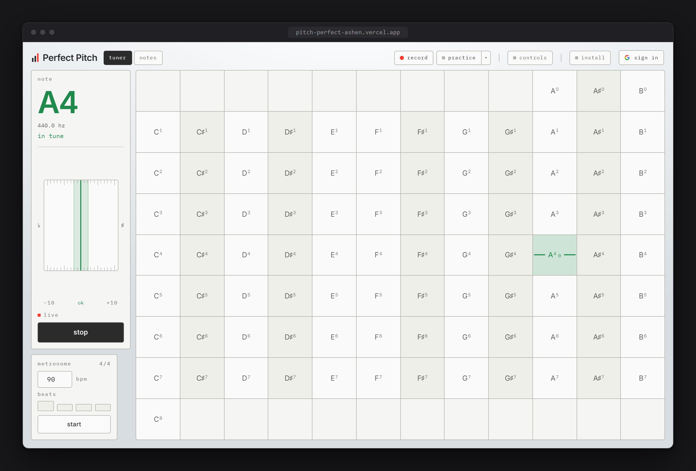
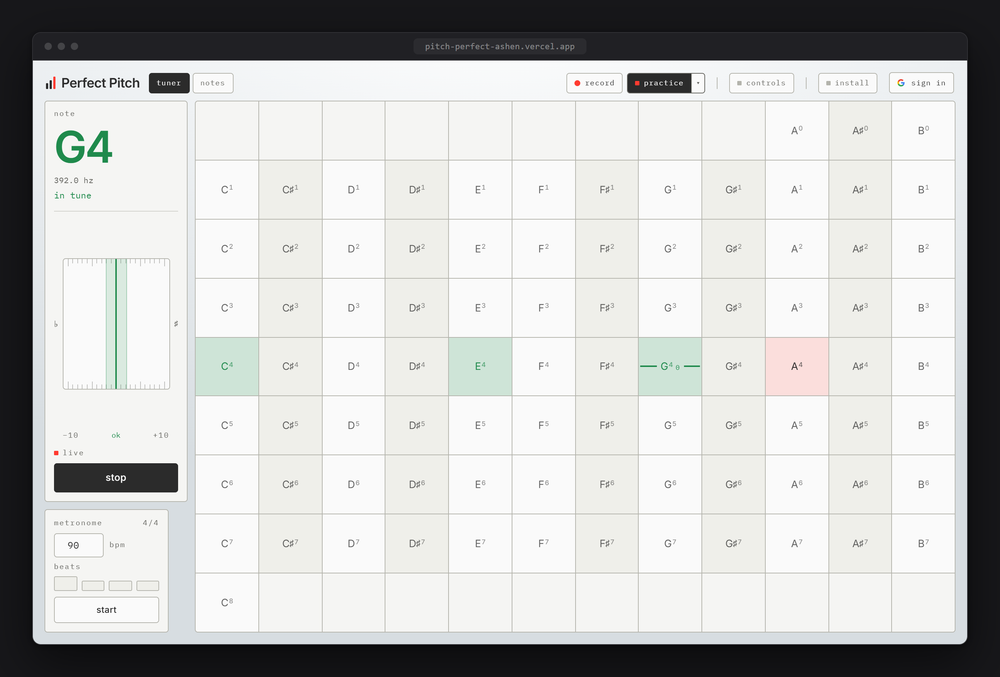
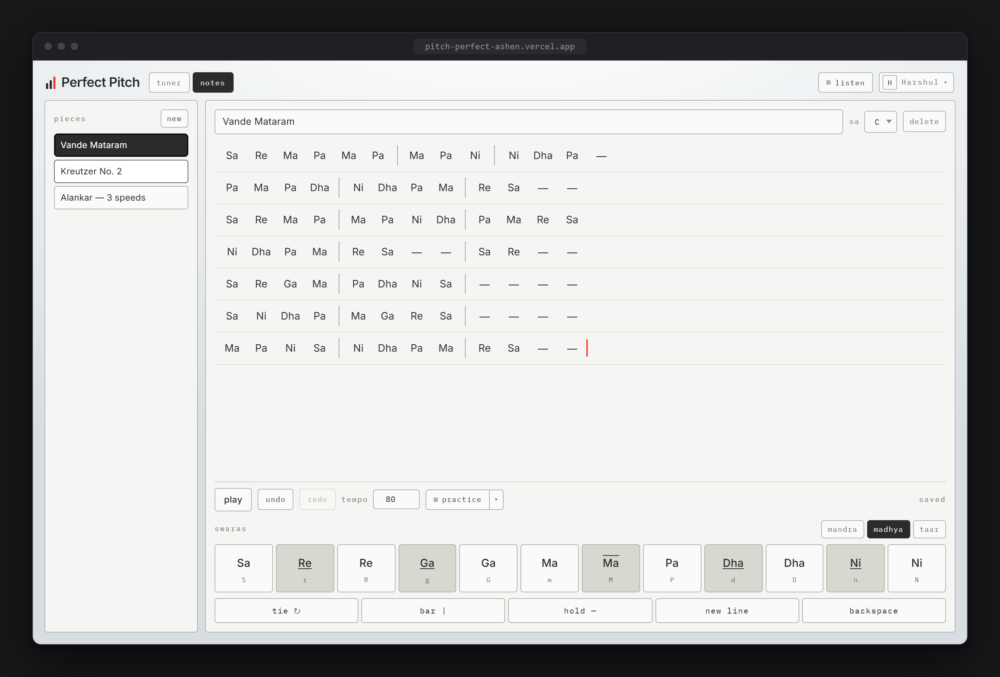
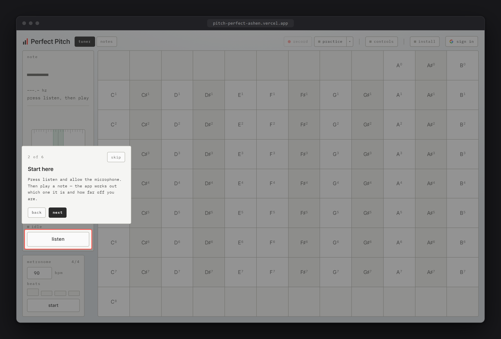
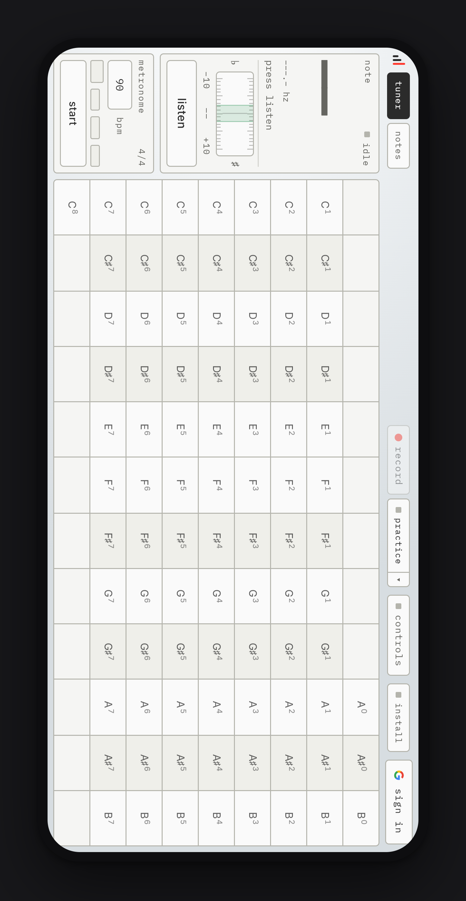

<div align="center">
<br>

**A violin tuner that tells you how close you are — not just which note.**

And a notebook for the pieces you are learning.

<br>

[**Open the app**](https://pitch-perfect-ashen.vercel.app/) &nbsp;·&nbsp; [How it works](#how-it-works) &nbsp;·&nbsp; [Run it](#run-it)

<br>
</div>

---

<br>

Most tuners name the note and stop. On a fretted instrument that is enough. On a
violin it is not — thirty cents flat is still recognisably C4, so a tuner that only
names the note will tell you a bad note is correct.

Perfect Pitch shows the cents. It remembers where you were sharp and where you were
flat across a whole passage, and it keeps the pieces you are working on in the same
place you tune. It runs in a browser, installs to a home screen, and works with no
network at all.

<br>

---

<div align="center">
<br>

<sub>**01** &nbsp; THE PROBLEM</sub>

### A violin has no frets.

Thirty cents flat is still recognisably C4.<br>
A tuner that only names the note will call a bad note correct.

</div>



<div align="center">
<sub><i>The name was never the hard part.</i></sub>
<br><br>
</div>

---

<div align="center">
<br>

<sub>**02** &nbsp; TUNE</sub>

### Every octave, all the time.

</div>



<div align="center">
<sub><i>Eighty-eight keys, because scordatura moves the range. Metronome, drone,<br>and a reference tone under every key.</i></sub>
<br><br>
</div>

---

<div align="center">
<br>

<sub>**03** &nbsp; PRACTICE</sub>

### The bed remembers.

</div>



<div align="center">
<sub><i>Green where you were in tune, red where you were not.<br>A passage leaves a map of its own intonation.</i></sub>
<br><br>
</div>

---

<div align="center">
<br>

<sub>**04** &nbsp; NOTES</sub>

### Write it. Hear it. Play it back.

</div>



<div align="center">
<sub><i>Sargam or Western letters, movable Sa. Then practise against it —<br>a note at a time, or a timed run that scores the whole thing.</i></sub>
<br><br>
</div>

---

<div align="center">
<br>

<sub>**05** &nbsp; FIRST RUN</sub>

### It explains itself, once.

</div>



<div align="center">
<sub><i>Six steps on the tuner, five in the notebook, offered on a first visit<br>and never again. Each one hands back the control it asks you to press.</i></sub>
<br><br>
</div>

---

<div align="center">
<br>

<sub>**06** &nbsp; ANYWHERE</sub>

### Turns sideways. Installs.

<br>



<br>

<sub><i>Nine octaves will not fit a portrait column, so the page turns itself.<br>Installed, it opens with no network at all.</i></sub>

<br>
</div>

---

<br>

## Run it

[Bun](https://bun.sh) is what the lockfile is for. Google Chrome is needed only for
the end-to-end tests, which drive a real browser.

```bash
bun install
bun run dev
```

Open the app, press **listen**, and allow the microphone. That is the whole tuner —
it needs no account and no configuration.

The notebook needs Firebase, because pieces are saved to an account and follow you
between devices. Copy `.env.example` to `.env.local` and fill it in from
`firebase apps:sdkconfig WEB <appId> --project <projectId>`:

```env
VITE_FIREBASE_API_KEY=
VITE_FIREBASE_AUTH_DOMAIN=
VITE_FIREBASE_PROJECT_ID=
VITE_FIREBASE_STORAGE_BUCKET=
VITE_FIREBASE_MESSAGING_SENDER_ID=
VITE_FIREBASE_APP_ID=
```

These ship to the browser and are not secrets — access is controlled by the security
rules below, not by hiding them. Without the file the tuner still runs; only signing
in is unavailable.

<br>

| Command             | What it does                  |
| ------------------- | ----------------------------- |
| `bun run dev`       | dev server                    |
| `bun run build`     | typecheck, then build         |
| `bun run test`      | unit tests — 325, in 26 files |
| `bun run e2e`       | Playwright, real Chrome — 84  |
| `bun run lint`      | ESLint                        |
| `bun run typecheck` | TypeScript, no emit           |
| `bun run format`    | Prettier                      |

<sub>The notebook's end-to-end tests sign in for real, so they need
`firebase emulators:start` first.</sub>

<br>

## How it works

**Pitch** — one equal-temperament formula, anchored at A4 = 440 Hz.

```
frequency(midi) = 440 * 2 ** ((midi - 69) / 12)
```

**Detection** — the McLeod Pitch Method: the first strong peak of a Normalised
Square Difference Function, not the tallest. That is what stops a bowed string's
harmonics reading an octave high. Echo cancellation, noise suppression and gain
control are all off; each one mangles a sustained tone.

<sub>One note at a time. Double stops waver between the two.</sub>

**Offline** — precache the build, hashed assets cache-first, navigations
network-first with the cached shell behind them. A Vite plugin stamps the file list
in at build from what Rollup actually produced, so the worker's list cannot drift
from the files that exist.

**Storage** — a piece belongs to its owner structurally, nested under their user id
rather than tagged with it. The rules check the shape of every write too, so a
compromised client cannot store arbitrary documents or exhaust the quota:

```
match /users/{uid}/compositions/{compositionId} {
  allow read, delete: if isOwner(uid);
  allow create, update: if isOwner(uid) && isWellFormed();
}
```

<br>

## Built with

| Layer     | Technology                             |
| --------- | -------------------------------------- |
| Interface | React 19 · React Router 8 · Tailwind 4 |
| Build     | Vite 8 · TypeScript 6                  |
| Sound     | Web Audio API, directly                |
| Account   | Firebase Auth · Firestore              |
| Offline   | A service worker generated at build    |
| Tests     | Vitest · Playwright                    |

No audio, charting or PWA library. Detection, synthesis, metronome scheduling and
the service worker are all first-party.

```
src/
├─ lib/          pitch, notation, practice, scoring
├─ hooks/        microphone, preferences, Firestore, install
├─ components/   key bed, readout, meter, editor
├─ routes/       tuner · notes
└─ sw.js         offline
e2e/             Playwright, against a real browser
docs/
├─ screenshots/  what is above
└─ superpowers/  a design doc per feature
```

<br>

## Contributing

Every feature here starts as a short design doc in
[`docs/superpowers/specs/`](docs/superpowers/specs/) and ends with tests that would
fail without it. Both are worth more than the diff.

```bash
git checkout -b your-branch
bun run test && bun run typecheck && bun run lint
bun run e2e                      # firebase emulators:start, for the notes tests
```

<br>

<div align="center">
<sub>

Built by [Harshul Rathod](https://github.com/Harshul1484) &nbsp;·&nbsp;
[Open the app](https://pitch-perfect-ashen.vercel.app/) &nbsp;·&nbsp;
[Design specs](docs/superpowers/specs/)

</sub>
</div>
